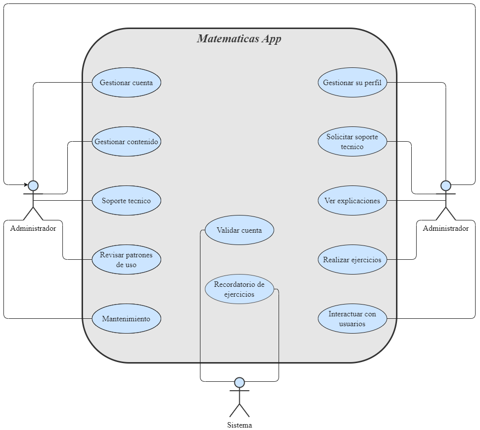

# Matemáticas

App para enseñar matematicas, con explicaciones, ejercicios y examenes.

## Especificación de Actores y Operaciones

<dl>Administrador: con permisos completos para gestionar la aplicación y moderar contenidos.
    <dd>Gestionar registros</dd>
    <dd>Gestionar el contenido</dd>
    <dd>Atender el soporte tecnico</dd>
    <dd>Comprobar la utilizacion de la aplicación</dd>
    <dd>Mantenimiento</dd>
</dl>

<dl>Usuario: que puede crear y modificar su perfil, así como interactuar con contenidos.
    <dd>Registrarse</dd>
    <dd>Gestionar su perfil</dd>
    <dd>Solicitar el soporte tecnico</dd>
    <dd>Utilizar las funciones de la aplicacion</dd>
    <dd>Hablar con otros usuarios</dd>
</dl>

